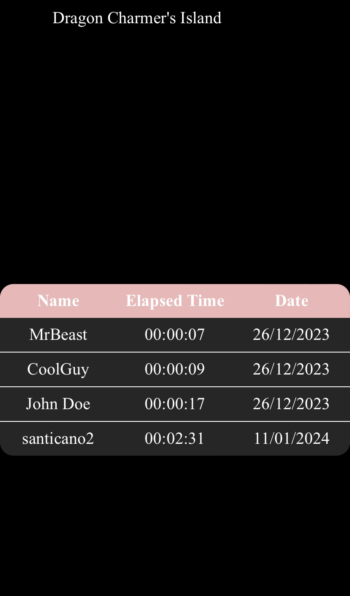
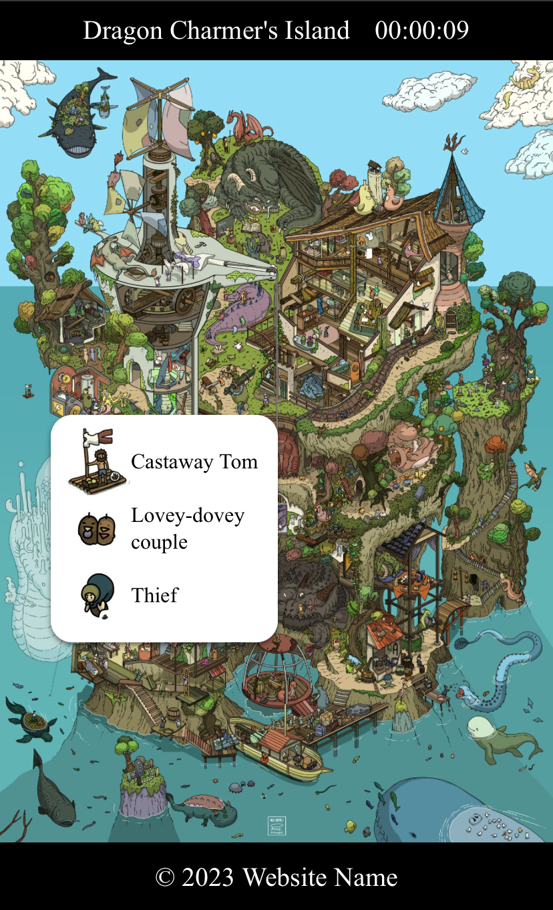

# Where's Waldo (A Photo Tagging App) Client Side
This this a Where's Waldo web game built using the MERN stack (MongoDB, Express.js, React.js, Node.js) along with the CSS module for styling.
Check out the [server-side repo](https://github.com/LaythAlqadhi/where-is-waldo-server-side).

## Preview
Check out the web application [Where's Waldo](https://where-is-waldo-five.vercel.app) to explore its features.

## Screenshots



## Pages
- Home page
- Game page
- Leaderboard page
- Not Found page

## Features
- Displaying a menu around the portion of the photo that the user has clicked.
- The menu contains a list of possible characters.
- Providing the user with appropriate feedback.
- Tracking of how long it takes from when the photo is first loaded to when the user finally identifies all of the characters.
- Displaying a modal once a round is complete to ask the user to add their name and record that time.

## Installation
1. **Clone the Repository:**
   ```bash
   git clone <repository_url>
   cd <repository_directory>
   ```

2. **Install Dependencies:**
   ```bash
   npm install
   ```

   or

   ```bash
   yarn install
   ```

3. **Development:**
   To start the development server, run:
   ```bash
   npm run dev
   ```

   or

   ```bash
   yarn dev
   ```

4. **Building the Application:**
   To build the application for production, run:
   ```bash
   npm run build
   ```

   or

   ```bash
   yarn build
   ```

5. **Previewing the Build:**
   To preview the production build locally, run:
   ```bash
   npm run preview
   ```

   or

   ```bash
   yarn preview
   ```

6. **Running Tests:**
   To run tests, execute:
   ```bash
   npm test
   ```

   or

   ```bash
   yarn test
   ```

## Additional Notes

- Make sure to have Node.js and npm/yarn installed and properly configured on your machine.
- This application uses ESLint for code linting and Prettier for code formatting. You can run linting using:
  ```bash
  npm run lint
  ```
  or
  ```bash
  yarn lint
  ```

- The application uses Vite as the build tool, React for the UI library, and React Router for routing.
- For detailed configuration and customization, refer to the `package.json` file and the respective configuration files (`eslintConfig`, `prettier`, etc.).